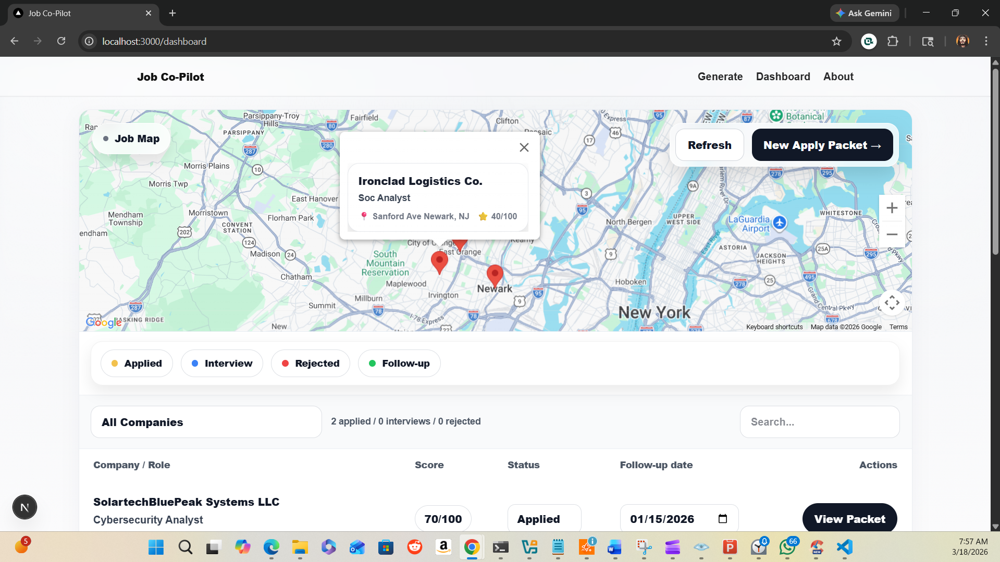
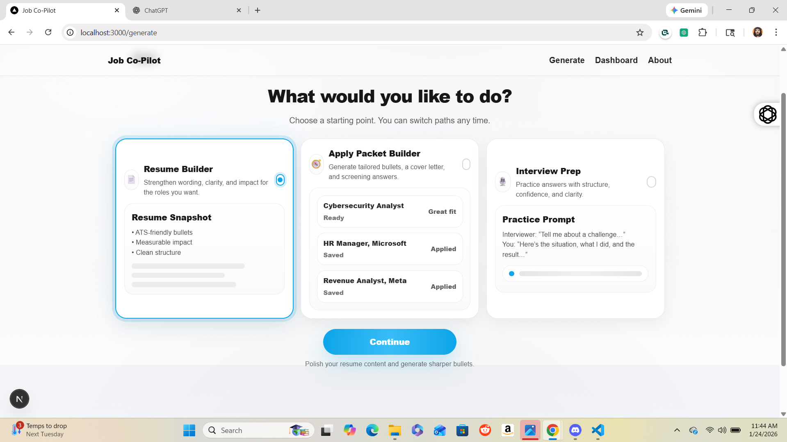
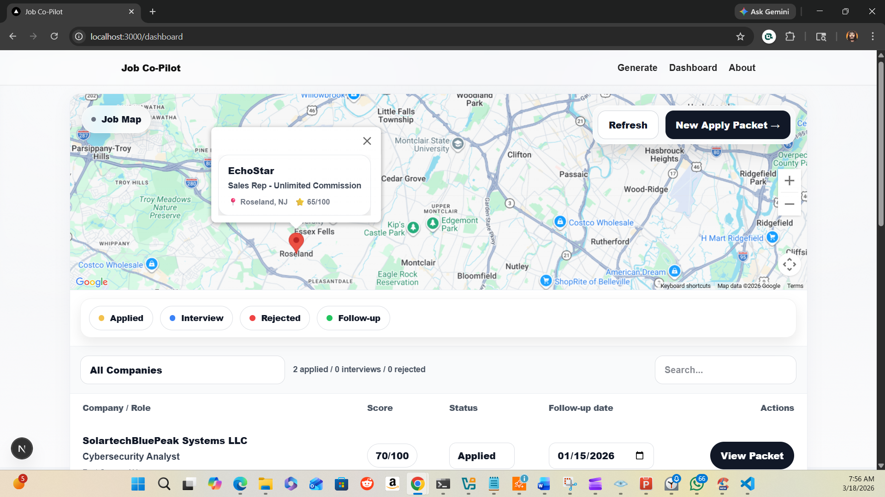
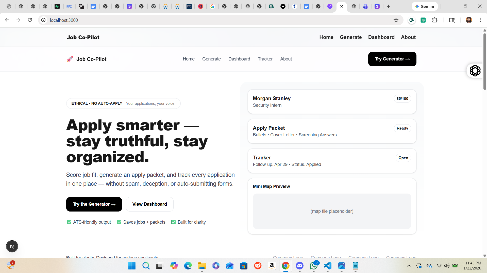
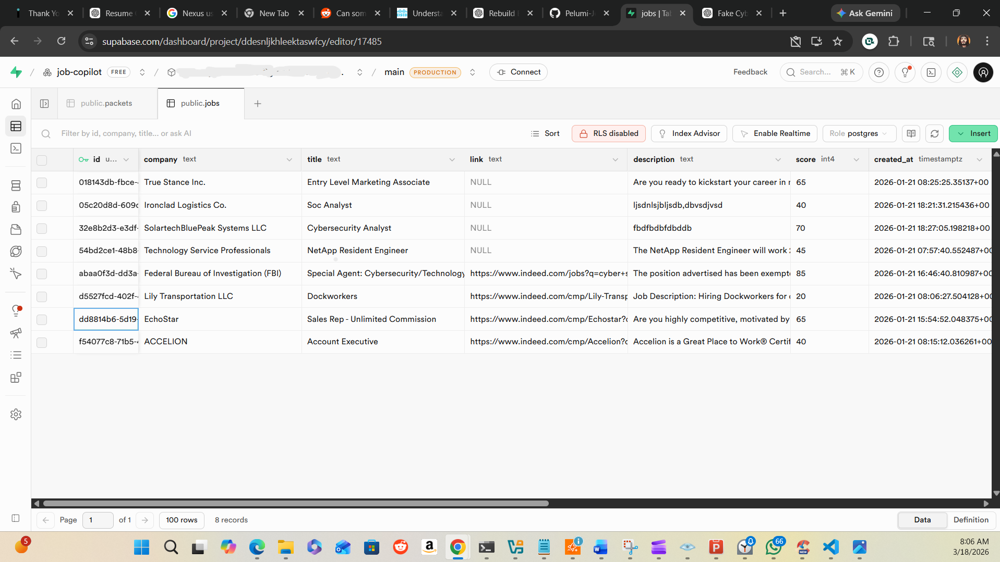

# Job Co Pilot

A personal system built to bring structure, clarity, and efficiency to the job application process.

## 🧠 Inspiration

While applying to jobs, I used a popular job copilot tool to automate parts of the process. It worked well until key features required payment.

Since the tools used to build these systems are publicly available, I decided to build my own version tailored to my workflow.

I am a cybersecurity student focused on understanding systems and solving real-world problems.

## 🚀 Features

- Job tracking dashboard
- Resume builder tailored to job descriptions
- Application workflow (step-by-step apply process)
- Interview preparation flow
- Job mapping system
- Scoring system to prioritize applications

## 🛠 Tech Stack

- Next.js
- Supabase
- Tailwind CSS
- OpenAI API
- Google Maps API

## 📸 Screenshots

### Dashboard

### Apply Flow

### Job Tracker

### Job Map

### Profile / Resume View

### Backend (Supabase)

## ⚠️ Note

This project is still in progress. Some features require API usage and are not fully public.

## 👤 Author

Pelumi Johnson
